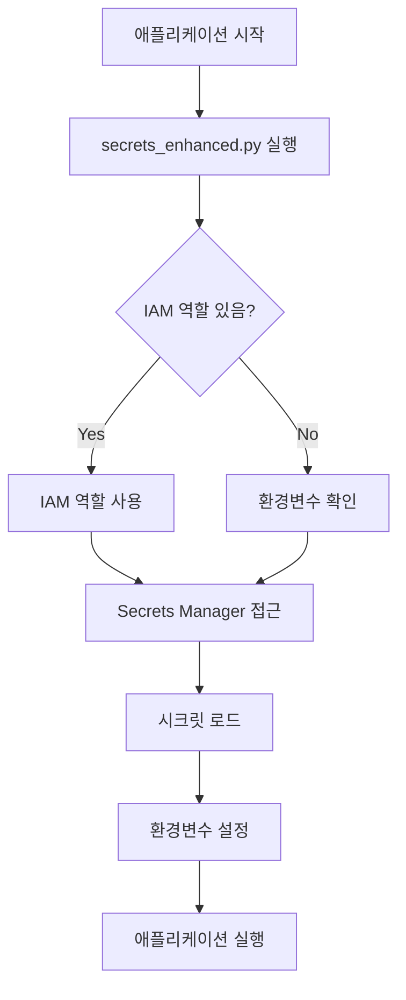

# AWS 자격증명 관리 가이드

## 🎯 핵심 원리

**AWS 자격증명을 서버에 직접 입력하지 않습니다!**

대신 IAM 역할(Role)을 사용하여 EC2/ECS가 자동으로 권한을 받도록 합니다.

## 🔄 작동 방식



## 📌 시나리오별 가이드

### 1️⃣ 새로운 EC2 인스턴스 배포

```bash
# 1. IAM 역할 생성 (한 번만)
bash deployment/setup_ec2_instance.sh

# 2. EC2 생성 시 역할 지정
aws ec2 run-instances \
    --iam-instance-profile Name=cdl-gateway-instance-profile \
    ...

# 3. 애플리케이션 배포
docker run cdl-gateway:latest
# → 자동으로 시크릿 로드됨!
```

### 2️⃣ 기존 EC2에 역할이 이미 있는 경우

```bash
# 1. 기존 역할에 권한만 추가
bash deployment/add_policy_to_existing_role.sh

# 2. 애플리케이션 재시작
docker restart cdl-gateway
# → 완료!
```

### 3️⃣ ECS/Fargate 배포

```bash
# 1. 태스크 역할 생성
bash deployment/setup_ecs_task.sh

# 2. 태스크 정의에 역할 지정
{
  "taskRoleArn": "arn:aws:iam::xxx:role/cdl-gateway-ecs-task-role",
  "executionRoleArn": "arn:aws:iam::xxx:role/cdl-gateway-ecs-execution-role"
}

# 3. 서비스 배포
aws ecs create-service ...
```

### 4️⃣ 로컬 개발

```bash
# 옵션 1: AWS CLI 설정
aws configure
# Access Key ID: xxx
# Secret Access Key: xxx

# 옵션 2: 환경변수
export AWS_ACCESS_KEY_ID=xxx
export AWS_SECRET_ACCESS_KEY=xxx

# 옵션 3: .env 파일
cp .env.example .env
# .env 파일 편집

# 실행
python app/main.py
```

## 🔐 Secrets Manager 구조

AWS Secrets Manager에 `cdl/ai/env` 시크릿 생성:

```json
{
  "OPENAI_API_KEY": "sk-xxx",
  "ANTHROPIC_API_KEY": "sk-ant-xxx",
  "GOOGLE_API_KEY": "xxx",
  "RABBITMQ_USER": "admin",
  "RABBITMQ_PASSWORD": "xxx",
  "RABBITMQ_HOSTNAME": "rabbitmq.example.com",
  "RABBITMQ_PORT": "5672",
  "AWS_REGION": "ap-northeast-2"
}
```

## 🚨 문제 해결

### "AWS 자격 증명을 찾을 수 없습니다"
- EC2: 인스턴스 프로파일 확인
- ECS: 태스크 역할 확인
- 로컬: AWS CLI 설정 확인

### "접근 권한이 없습니다: cdl/ai/env"
```bash
# 권한 추가
bash deployment/add_policy_to_existing_role.sh
```

### "시크릿을 찾을 수 없습니다"
```bash
# 시크릿 생성
aws secretsmanager create-secret \
    --name cdl/ai/env \
    --secret-string file://secrets.json
```

## ✅ 체크리스트

- [ ] IAM 역할 생성 또는 기존 역할 확인
- [ ] Secrets Manager 권한 추가
- [ ] EC2/ECS에 역할 연결
- [ ] Secrets Manager에 시크릿 생성
- [ ] 애플리케이션 배포
- [ ] 로그 확인: "✅ IAM 역할 인증 성공!"

## 🎉 장점

1. **보안**: 자격증명 하드코딩 없음
2. **자동화**: 서버가 자동으로 권한 획득
3. **중앙 관리**: Secrets Manager에서 한 곳 관리
4. **교체 용이**: 시크릿 로테이션 지원
5. **감사**: CloudTrail로 접근 로그 추적